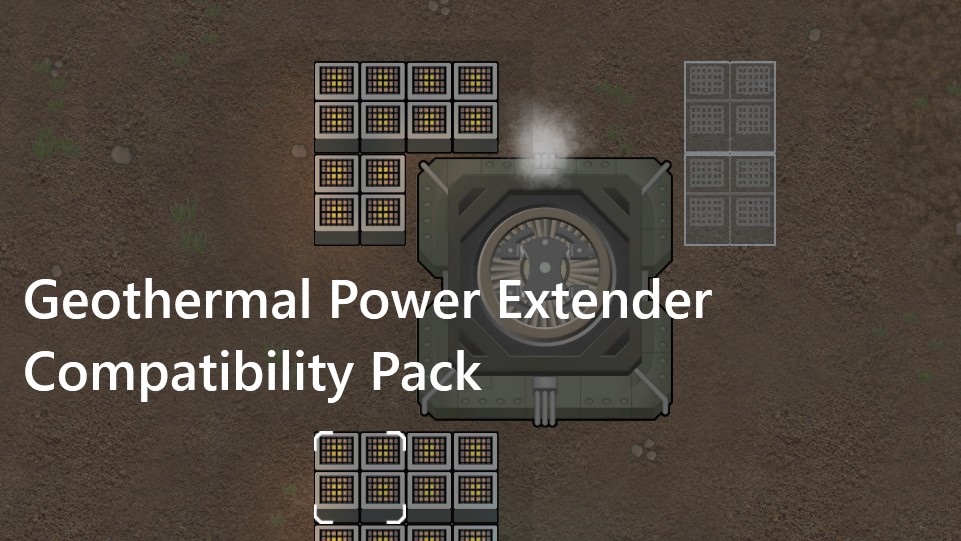
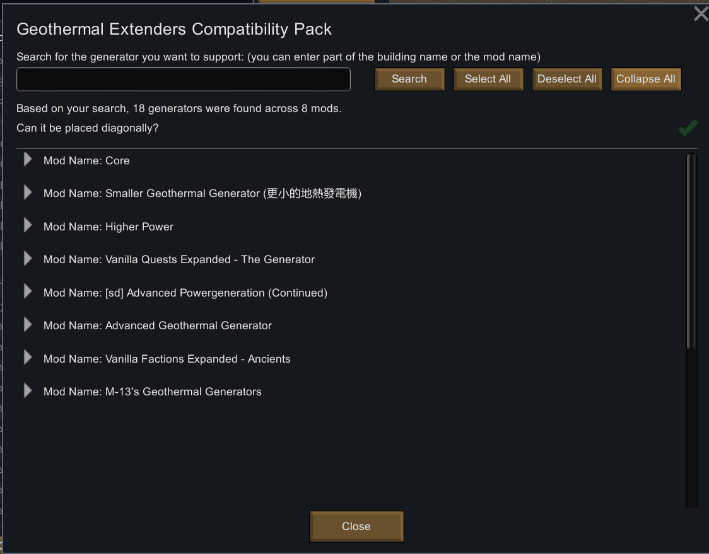
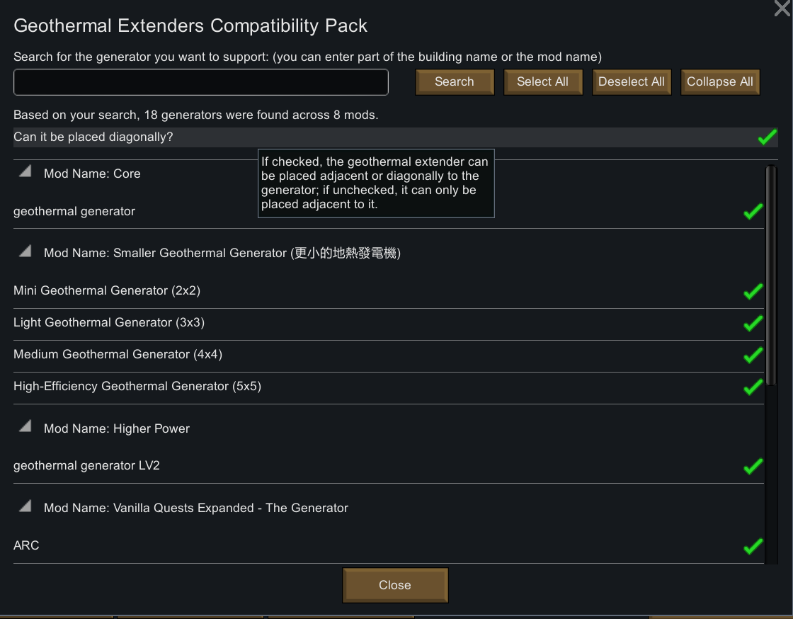
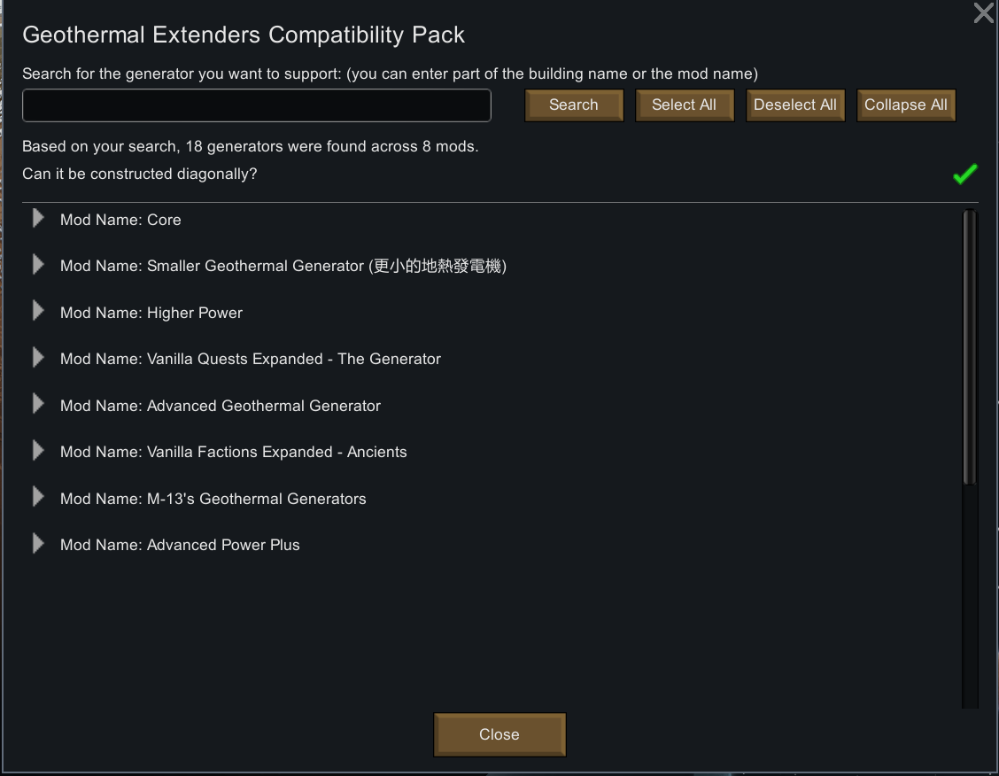

# Geothermal Power Extender Compatibility Pack

[繁體中文說明](./README.zh.md) | [English README](./README.md)

## Introduction:
This is a mod that improves [Geothermal Power Extenders](https://steamcommunity.com/sharedfiles/filedetails/?id=3373466885)'s compatibility. Now, you can choose to build power extenders next to the geothermal generator provided by other mods. It is also allowed for power extenders to be constructed in the diagonal direction of the geothermal generator.

The main reason I developed this mod is that while working on a self-made mod - [Smaller Geothermal Generator (更小的地熱發電機)](https://steamcommunity.com/sharedfiles/filedetails/?id=3456671049), I found it was incompatible with [Geothermal Power Extenders](https://steamcommunity.com/sharedfiles/filedetails/?id=3373466885).

Since [Geothermal Power Extenders](https://steamcommunity.com/sharedfiles/filedetails/?id=3373466885) is widely used by many players, I decided to create a compatibility patch to make [Geothermal Power Extenders](https://steamcommunity.com/sharedfiles/filedetails/?id=3373466885) support other geothermal generators.

## How to use:
1. Go to the [Steam Workshop](https://steamcommunity.com/sharedfiles/filedetails/?id=3460251810) and subscribe to or download this mod from [release page](https://github.com/emoryoakley/GeothermalPowerExtendersCompatibilityPack/releases).
2. Enable this mod in the game (Must be loaded after [Geothermal Power Extenders](https://steamcommunity.com/sharedfiles/filedetails/?id=3373466885).). 
3. Go to the mod settings to configure the geothermal generator you want to support and whether it can be constructed diagonally.
4. Just like using [Geothermal Power Extenders](https://steamcommunity.com/sharedfiles/filedetails/?id=3373466885) normally.

## Language:
This mod includes built-in support for Traditional Chinese, Simplified Chinese, and English (Default language). If translations for other languages are needed, due to limitations in maintenance resources, they cannot all be integrated into the mod. You are welcome to develop and upload your own language translation mods.

## Compatibility:
- The following mods have been tested, and all of them are compatible with this mod.
    - Core (Vanilla)
    - [Higher Power](https://steamcommunity.com/sharedfiles/filedetails/?id=1409449372)
    - [Smaller Geothermal Generator (更小的地熱發電機)](https://steamcommunity.com/sharedfiles/filedetails/?id=3456671049)
    - [[sd] Advanced Powergeneration (Continued)](https://steamcommunity.com/sharedfiles/filedetails/?id=2079579039)
    - [Advanced Power Plus](https://steamcommunity.com/workshop/filedetails/?id=2032409628)
    - [Vanilla Factions Expanded - Ancients](https://steamcommunity.com/workshop/filedetails/?id=2654846754)
    - [Vanilla Quests Expanded - The Generator](https://steamcommunity.com/sharedfiles/filedetails/?id=3411401573)
- The following mods are still usable and compatible with this mod, even though they haven't been updated to the latest game version, 1.5.
    - [Advanced Geothermal Generator](https://steamcommunity.com/sharedfiles/filedetails/?id=2086966048)
    - [M-13's Geothermal Generators](https://steamcommunity.com/sharedfiles/filedetails/?id=1541519278)
- The geothermal generators provided by other mods can theoretically be supported, not limited to the ones mentioned above.

## Other Notes:
- This mod depends on [Geothermal Power Extenders](https://steamcommunity.com/sharedfiles/filedetails/?id=3373466885). Please load [Geothermal Power Extenders](https://steamcommunity.com/sharedfiles/filedetails/?id=3373466885) before loading this mod. 

## Latest Mod Version:
- Version: 1.5.20250411
- Compatible with RimWorld 1.5
