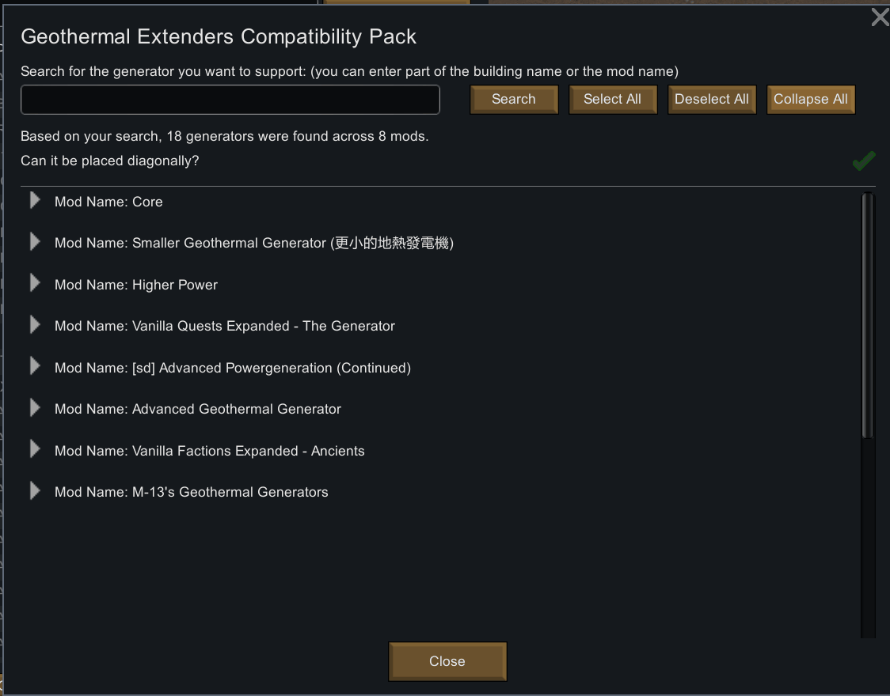
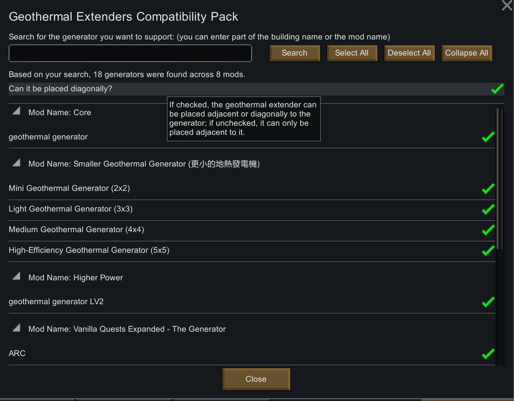
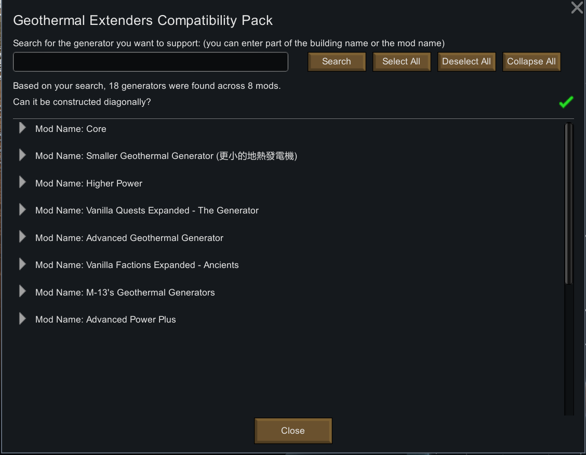

# Geothermal Power Extender Compatibility Pack

[繁體中文說明](./README.zh.md) | [English README](./README.md)

## 簡介：
這是一個改善 [Geothermal Power Extender](https://steamcommunity.com/sharedfiles/filedetails/?id=3373466885) 相容性的模組。現在，您可以選擇在其他模組提供的地熱發電機旁建造Power Extender。還可以允許 Power Extender 建造在地熱發電機的對角方向。

我開發這個模組的主要原因是，在製作我自己的模組 [Smaller Geothermal Generator (更小的地熱發電機)](https://steamcommunity.com/sharedfiles/filedetails/?id=3456671049) 的過程中，發現它無法相容於 [Geothermal Power Extenders](https://steamcommunity.com/sharedfiles/filedetails/?id=3373466885) 。

由於 [Geothermal Power Extenders](https://steamcommunity.com/sharedfiles/filedetails/?id=3373466885) 被許多玩家廣泛使用，我決定製作一個相容性補丁，使 [Geothermal Power Extenders](https://steamcommunity.com/sharedfiles/filedetails/?id=3373466885) 可以支援其他地熱發電機。

## 如何使用：
1. 前往 [Steam 工作坊](https://steamcommunity.com/sharedfiles/filedetails/?id=3460251810)，訂閱此模組或從 [release page](https://github.com/emoryoakley/GeothermalPowerExtendersCompatibilityPack/releases) 下載。
2. 在遊戲中啟用此模組（必須在 [Geothermal Power Extenders](https://steamcommunity.com/sharedfiles/filedetails/?id=3373466885) 之後載入）。
3. 前往模組設置，設定您想支援的地熱發電機，以及是否允許建造在對角方向。
4. 像平常使用 [Geothermal Power Extenders](https://steamcommunity.com/sharedfiles/filedetails/?id=3373466885) 一樣使用此模組。

## 語言：
本模組內建有繁體中文、簡體中文以及英文，模組預設語言為英文。
若需要其他語言翻譯，因維運人力關係無法全數合併至本模組當中，歡迎自行開發並上傳翻譯的語言模組。

## 相容性：
- 已測試以下模組，均與本模組相容：
    - Core（原版地熱發電機）
    - [Higher Power](https://steamcommunity.com/sharedfiles/filedetails/?id=1409449372)
    - [Smaller Geothermal Generator (更小的地熱發電機)](https://steamcommunity.com/sharedfiles/filedetails/?id=3456671049)
    - [[sd] Advanced Powergeneration (Continued)](https://steamcommunity.com/sharedfiles/filedetails/?id=2079579039)
    - [Advanced Power Plus](https://steamcommunity.com/workshop/filedetails/?id=2032409628)
    - [Vanilla Factions Expanded - Ancients](https://steamcommunity.com/workshop/filedetails/?id=2654846754)
    - [Vanilla Quests Expanded - The Generator](https://steamcommunity.com/sharedfiles/filedetails/?id=3411401573)
- 以下模組雖然尚未更新至最新遊戲版本 1.5，但仍可使用且與本模組相容：
    - [Advanced Geothermal Generator](https://steamcommunity.com/sharedfiles/filedetails/?id=2086966048)
    - [M-13's Geothermal Generators](https://steamcommunity.com/sharedfiles/filedetails/?id=1541519278)
- 其他模組提供的地熱發電機理論上都可以支援，不僅限於上述提及的模組。

## 其他注意事項：
- 此模組依賴於 [Geothermal Power Extenders](https://steamcommunity.com/sharedfiles/filedetails/?id=3373466885)。請在載入此模組前，先載入 [Geothermal Power Extenders](https://steamcommunity.com/sharedfiles/filedetails/?id=3373466885)。

## 最新模組版本：
- 版本：1.5.20250411
- 相容於 RimWorld 1.5
